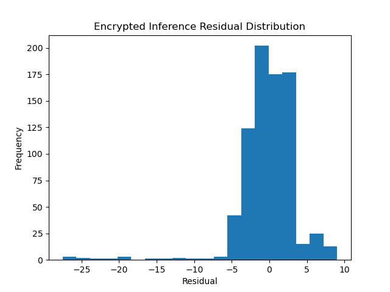

# Encrypted Linear Regression Model
### Description
This project was developed for the 2024 METIL Quickstart Intership for the US Department of Energy's ORETCC team. It examines the performance of a linear regression machine learning (ML) model on simulated manufacturing data to predict product quality rating in comparison to a fully homomorphic encrypted (FHE) inferencing algorithm using the same test data and the trained model’s weights as regression coefficients. The goal is to demonstrate that FHE can be used to secure ML models against post-Quantum attacks while maintaining sufficient performance on a given task.

### Table of Contents
1. [Installation](#installation)
2. [Usage](#usage)
3. [Features](#features)
4. [Project Structure](#project-structure)
5. [How It Works](#how-it-works)
6. [License](#license)
7. [Contact](#contact)

### Installation
1. Clone the repository:

    ```git clone https://github.com/JustinMorera/METIL-Quickstart-Internship.git```

2. Install dependencies:

    ```pip install -r requirements.txt```

Ensure Python 3.11.15+ is installed.

### Usage
To run the project, follow these steps:
1. Navigate to the `Python` directory where the Jupyter notebook, `project.ipynb`, and `requirements.txt` are located.

2. Install the required dependencies:

    ```pip install -r requirements.txt```

3. Execute the cells sequentially to run the project.

### Features
* Homomorphic encryption with the CKKS scheme.
* Performance evaluation: MAE, MSE, RMSE, R².
* Residual analysis with saved visualizations.
    #### Examples
    Residual plots:




### Project Structure
```/datasets - Datasets for training and testing```

```/docs - Research report, Excel spreadsheet data, and saved graphs```

```/Python - Project code and requirements.txt```

```README.md - This file```

```LICENSE - Official license```

### How It Works
1. Input data is preprocessed and polynomial features are formed.

2. A linear regressor is trained and evaluated on the processed data.

3. MAE, MSE, RMSE, R^2, and residuals are measured along with runtime and memory usage.

4. The model's coefficients and intercept are saved for encrypted inference.

5. The saved values and the input data are encrypted using CKKS FHE.

6. Encrypted inference is performed on the same test data.

7. The same performance metrics are tracked:

    * MAE, MSE, RMSE, R^2, residuals, runtime, and memory usage.

8. Metrics are printed side-by-side and are also sent to `Analyses.xlsx` for further analysis.

    * `Analyses_Edited.xlsx` has final values and graphs from the project in the official report.

### License
This project is licensed under the Apache 2.0 License.

### Contact
For questions or contributions, reach out to: Justin Morera

- [Email](mailto:mustinjorera@gmail.com)
- [GitHub](https://github.com/JustinMorera)
- [LinkedIn](https://www.linkedin.com/in/justin-morera-a4a568153/)
